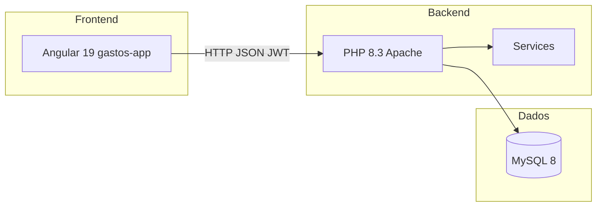

# Tostoes — Documentação do Projeto

Aplicação web de **planejamento e controle financeiro familiar** (inspirada em fluxos tipo Mobills), com foco em separar **recebimentos**, **gastos**, **investimentos** e **metas**, por mês e por planejamento compartilhado. O produto na interface chama-se **Tostoes**.

Este documento descreve arquitetura, modelo de dados, regras de negócio e **todas as funcionalidades** implementadas no repositório.

---

## Índice

1. [Visão geral](#visão-geral)
2. [Arquitetura](#arquitetura)
3. [Estrutura do repositório](#estrutura-do-repositório)
4. [Como executar](#como-executar)
5. [Conceitos centrais](#conceitos-centrais)
6. [Autenticação e perfil](#autenticação-e-perfil)
7. [Planejamentos e convites](#planejamentos-e-convites)
8. [Contas financeiras](#contas-financeiras)
9. [Itens fixos (recorrentes)](#itens-fixos-recorrentes)
10. [Plano do mês e Movimentos](#plano-do-mês-e-movimentos)
11. [Metas financeiras](#metas-financeiras)
12. [Transações e extrato](#transações-e-extrato)
13. [Dashboard (Início)](#dashboard-início)
14. [Grafo de contas](#grafo-de-contas)
15. [Configurações e taxonomia](#configurações-e-taxonomia)
16. [Câmbio EUR/BRL](#câmbio-eurbbrl)
17. [API REST](#api-rest)
18. [Banco de dados](#banco-de-dados)
19. [Scripts e manutenção](#scripts-e-manutenção)
20. [Frontend Angular](#frontend-angular)

---

## Visão geral

### Objetivo

Permitir que um casal ou família:

- Cadastre **contas bancárias** e de **investimento** com saldos reais derivados de lançamentos.
- Defina **gastos**, **recebimentos** e **aportes** que se repetem todo mês (**fixos**).
- Planeje cada mês com itens **pendentes** e os **confirme** quando o dinheiro entra ou sai (**Movimentos**).
- Lance **custos variáveis** só naquele mês (ex.: compra pontual).
- Acompanhe **metas** (valor alvo, prazo, parcela mensal uniforme, conta de destino).
- Veja **previsto vs real** no dashboard, extratos e grafo de fluxos.
- Trabalhe em mais de um **planejamento** (ex.: “Casa”, “Viagem”) com vários membros.

### Tipos de lançamento (`kind`)

| `kind`        | Uso |
|---------------|-----|
| `income`      | Recebimentos (salário, transferências recebidas, espelho de aporte em conta investimento). |
| `expense`     | Gastos e custos. |
| `investment`  | Saída do banco para aporte; metas usam o mesmo `kind` no plano mas somam em “metas”, não em “investimento” nos totais. |
| `leisure`     | Lazer (legado/configuração; menos exposto na UI principal). |

### Moedas e regiões

- Moedas: **BRL** e **EUR** (valores convertidos para BRL em relatórios via cotação do dia ou fallback).
- Região: `BR`, `PT` ou `geral` (classificação geográfica nos itens).

### Linha do tempo do planejamento

A migração **021** fixa o **início de uso** do planejamento em **junho/2026** (`plannings.created_at` e contas de investimento). Meses anteriores no calendário aparecem como inativos no dashboard; meses passados usam o **plano congelado** (não re-sincronizam fixos atuais).

---

## Arquitetura



| Camada | Tecnologia |
|--------|------------|
| UI | Angular 19, standalone components, signals, SCSS, Chart.js (gráficos), Cytoscape + dagre (grafo) |
| API | PHP 8.3, PDO, roteador manual em `Router.php`, sem framework full-stack |
| Auth | JWT no header `Authorization: Bearer` + `X-Planning-Id` para o planejamento ativo |
| DB | MySQL 8.4 (Docker porta **3308**) |
| Deploy local | `docker-compose.yml` (serviços `mysql` + `api`) |

A API expõe rotas sob o prefixo `/api` (proxy do Angular em desenvolvimento: `environment.apiUrl = "/api"`).

---

## Estrutura do repositório

```
gastos/
├── PROJETO.md              ← este arquivo
├── README.md               ← início rápido (Docker + login)
├── docker-compose.yml      ← MySQL + API
├── api/
│   ├── public/             ← index.php, router.php
│   ├── src/
│   │   ├── Controllers/    ← endpoints HTTP
│   │   ├── Services/       ← regras de negócio
│   │   ├── Auth.php, MoneyHelper.php, ResponsibleUser.php
│   │   └── Router.php
│   ├── database/
│   │   ├── schema.sql      ← tabelas legado/usuário
│   │   └── migrations/     ← 002–021 incrementais
│   ├── scripts/
│   │   ├── migrate.php     ← schema + migrações + seed
│   │   └── migrate.php, reset-data.php, clear-months-before.php, …
│   └── .env / .env.docker
└── gastos-app/
    ├── src/app/
    │   ├── core/           ← guards, services, models
    │   ├── features/       ← páginas por rota
    │   └── shared/         ← month-nav, avatar, dialogs
    └── scripts/generate-env.mjs
```

---

## Como executar

### Docker (recomendado)

```bash
docker compose up -d --build
```

| Serviço | Endereço |
|---------|----------|
| API | http://localhost:8090/api |
| MySQL | `127.0.0.1:3308`, usuário `root`, senha `root`, database `gastos` |

Na subida, o entrypoint da API roda `migrate.php` (cria estrutura e usuários iniciais conforme `SETUP_PASSWORD` no `.env.docker`).

### Frontend

```bash
cd gastos-app
npm install
npm start   # gera environment e sobe em http://localhost:4200
```

### Variáveis importantes (`api/.env`)

| Variável | Função |
|----------|--------|
| `DB_HOST`, `DB_PORT`, `DB_NAME`, `DB_USER`, `DB_PASS` | Conexão MySQL |
| `JWT_SECRET` | Assinatura do token |
| `CORS_ORIGIN` | Origem permitida (ex.: `http://localhost:4200`) |
| `APP_TIMEZONE` | Fuso (ex.: `America/Sao_Paulo`) |
| `SETUP_USER`, `SETUP_PASSWORD`, `SETUP_NAME` | Usuário criado/atualizado no migrate |

---

## Conceitos centrais

### Planejamento (`planning`)

Unidade de isolamento dos dados financeiros: contas, fixos, plano do mês, transações, metas e configurações. Um usuário pode pertencer a vários planejamentos (`planning_members`: `owner` ou `member`). O frontend guarda o ID ativo e envia `X-Planning-Id` em cada requisição.

### Fixo vs variável

| | Fixo | Variável |
|---|------|----------|
| Origem | Cadastro em **Gastos/Recebimentos/Investimentos fixos** (`recurring_items` com `is_fixed = 1`) | Botão **Novo** em **Movimentos** |
| Plano do mês | Entrada com `recurring_item_id` preenchido; sincronizada por mês | Entrada com `recurring_item_id` NULL |
| Valor por mês | `recurring_item_amounts` (tabela mês → valor) ou padrão | Valor digitado só naquele mês |
| Após confirmar | `status = confirmed`, `transaction_id` ligado | Igual |

### Status no plano do mês (`month_plan_entries.status`)

- **`pending`**: ainda não virou transação (aparece em Movimentos na coluna pendentes).
- **`confirmed`**: confirmado; gera (ou ligou) transação(ões).
- **`skipped`**: ignorado no mês (fixo pode ser pulado com ✕).

### Previsto vs real

- **Real**: soma de `transactions` no mês (confirmados de fato).
- **Previsto** (mês corrente/futuro): fixos ativos sincronizados + metas com parcela recalculada + variáveis pendentes (onde a regra incluir).
- **Previsto** (mês passado): lê o que estava em `month_plan_entries` naquele mês (histórico congelado), sem re-aplicar catálogo atual de fixos.

### Responsável

Itens podem ter `responsible_user_id` (membro do planejamento). Nas telas de fixos há abas **Conjunto** / por pessoa (avatar).

---

## Autenticação e perfil

### Rotas públicas (sem login)

- `/login` — usuário + senha (username normalizado para minúsculas).
- `/cadastro` — registro de nova conta.
- `/recuperar-senha` — solicita e-mail de redefinição.
- `/redefinir-senha` — token da URL.
- `/convite/:token` — aceitar convite ao planejamento.

### Rotas autenticadas

- `/perfil` — nome, e-mail, avatar, alteração de senha.
- Restante do app atrás de `authGuard`.

### API de autenticação

- `POST /auth/login` → JWT + usuário.
- `POST /auth/register`
- `GET /auth/me`
- `GET /auth/users` — membros do planejamento (household).
- `POST /auth/forgot-password`, `POST /auth/reset-password`
- `PATCH /auth/profile`, `POST /auth/change-password`, `POST /auth/avatar`
- `GET /auth/avatars/{id}` — imagem pública do avatar.

### Perfil

- Avatar enviado como multipart; exibido via `UserAvatarComponent` (iniciais ou foto).
- Gênero (`male`/`female`) usado em estilização leve da UI.

---

## Planejamentos e convites

### Na sidebar (layout)

- Lista de planejamentos do usuário; troca de planejamento ativo (recarrega a página).
- **+** cria planejamento novo (`POST /plannings`).
- **Convidar por e-mail** → `POST /plannings/{id}/invites` (token 64 caracteres hex).

### Convite

1. Convidado abre `/convite/{token}`.
2. `GET /invites/{token}` mostra preview (planejamento, quem convidou, expiração).
3. `POST /invites/{token}` aceita (usuário logado ou fluxo de cadastro).

### Papéis

- **owner**: criador; dono dos lançamentos “sistêmicos” em alguns fluxos.
- **member**: acesso completo aos dados do planejamento, conforme `PlanningAccess`.

---

## Contas financeiras

### Tipos

- **`bank`**: conta corrente/poupança; recebe recebimentos e paga despesas/aportes.
- **`investment`**: carteira, reserva, imóvel como investimento, etc.

### Campos principais

- Nome, cor, moeda (`BRL`/`EUR`), saldo inicial + data de referência.
- Ordenação (`sort_order`), flag `active`.

### Tela **Contas** (`/contas`)

- Lista patrimônio (bancos + investimentos) com saldo **dinâmico** (saldo inicial + transações até hoje).
- Contas em EUR mostram equivalente em BRL com cotação.
- Detalhe da conta: extrato mensal (filtro ano/mês, tipo, busca).
- CRUD: criar, editar, desativar conta.

### API

- `GET /accounts`, `POST /accounts`, `GET|PUT|DELETE /accounts/{id}`
- `GET /accounts/summary` — totais agregados para o painel de patrimônio.

### Conta origem / destino (migração 019)

- Fixos e plano: `source_financial_account_id` (banco que paga) e `financial_account_id` (destino: banco em recebimento, investimento em aporte).
- Metas: `source_financial_account_id` e `target_financial_account_id`.

---

## Itens fixos (recorrentes)

Três rotas reutilizam o mesmo componente `FixedItemsComponent` com `data.kind`:

| Rota | Tipo | Cor tema |
|------|------|----------|
| `/gastos-fixos` | `expense` | Vermelho |
| `/recebimentos-fixos` | `income` | Verde |
| `/investimentos-fixos` | `investment` | Roxo |

### Funcionalidades da tela

- Listagem em cards com valor do mês, dia de vencimento, categoria, aba personalizada, região.
- **Abas por responsável** (`userOverviewTabs`): Conjunto, membros do planejamento, etc.
- Avatar do responsável no card.
- Edição inline / modal: nome, valores por mês (grade 1–12), moeda EUR/BRL, contas origem/destino, tipo de investimento, taxonomia.
- Ativar/desativar item (`active`); só itens com `is_fixed = 1` entram na sincronização mensal.
- Ícones de categoria configuráveis em **Configurações**.

### API

- `GET /recurring-items?kind=expense|income|investment`
- `POST /recurring-items`, `PUT /recurring-items/{id}`, `DELETE /recurring-items/{id}`
- Valores mensais em `recurring_item_amounts`.

### Sincronização no plano

`MonthPlanService::syncAllFixedForMonth` (para mês atual/futuro):

- Para cada fixo ativo sem entrada naquele mês, cria `month_plan_entries` pendente.
- Atualiza valores a partir de `recurring_item_amounts` ou `default_amount_brl`.

---

## Plano do mês e Movimentos

### Tela **Movimentos** (`/movimentos`)

Coração operacional do sistema.

#### Layout

- Navegação **ano/mês** (`MonthNavComponent`).
- Faixa de estatísticas: recebimentos, gastos, saldo confirmado, contagem de pendentes.
- Faixa **Previsto** (quando aplicável): totais projetados do mês.
- Duas colunas:
  - **Pendentes** — itens `status = pending`.
  - **Confirmados** — itens já confirmados no mês (somente leitura visual; ações limitadas).

#### Ações por item pendente

- **Confirmar** — abre diálogo (`ConfirmAccountDialogComponent`): valor, data, conta(s). Gera transação(ões) e marca entrada como confirmada.
- **Investimento**: valida par banco → investimento; cria débito no banco e espelho `income` na conta investimento com notas “Aporte”.
- **Pular** (`POST /month-plan/{id}/skip`) — fixos; equivale a ignorar no mês.
- **Remover** — só **variáveis** pendentes (`DELETE /month-plan/{id}`).
- **Editar** — altera nome, valor, categoria, contas, responsável (variáveis têm mais liberdade).

#### Ações em confirmados

- **Desfazer** (`POST /month-plan/{id}/unconfirm`) — volta para pendente, remove transações ligadas e espelhos de aporte; recalcula saldos e parcelas de metas.
- Transações avulsas confirmadas sem plano: `POST /transactions/{id}/unconfirm`.

#### Lançamento variável

- Botão **Novo** → `POST /month-plan` sem `recurring_item_id`.
- Aparece só naquele mês; no grafo entra no modo **Mês atual**, não no **Previsto**.

#### Ledger

`GET /ledger?year=&month=` monta a visão unificada (pendentes + confirmados + resumo projetado) usada pela tela.

### Regenerar plano

`POST /month-plan/regenerate` — recria entradas de fixos para o mês (cuidado em produção; uso administrativo).

### Spawn manual

`POST /month-plan/spawn` — cria entrada para um `recurringItemId` específico naquele mês.

---

## Metas financeiras

### Tela **Metas** (`/metas`)

- CRUD de metas: nome, cor, valor alvo, **data início/fim**, dia de vencimento, conta origem (banco) e **conta destino** (obrigatória para progresso dinâmico).
- **Sem “valor inicial” fixo no formulário**: progresso usa o **saldo atual da conta destino** (dinâmico).
- Parcela mensal **uniforme** em todos os meses do período (`GoalPlanService::uniformMonthlyInstallment`) — evita parcela maior no último mês do calendário.
- Cada meta gera entradas pendentes no plano (`financial_goal_id`) em meses dentro do período; confirmar em Movimentos como investimento/meta.

### API

- `GET /goals?year=&month=`
- `POST /goals`, `PUT /goals/{id}`, `DELETE /goals/{id}`

### Dashboard

Gráfico de barras por meta: faixa “estimativa até hoje” vs “confirmado”, parcela/mês e previsto no mês selecionado.

---

## Transações e extrato

### Tabela `transactions`

Lançamento definitivo no extrato: data, descrição, valor, moeda, `amount_brl`, categoria, região, conta (`account_id`), tipo de investimento, quem registrou (`registered_by_user_id`), notas.

### Regras

- `DELETE /transactions/{id}` bloqueado se a transação estiver ligada a entrada do plano (use desfazer no plano).
- Edição direta de transações avulsas via `PUT /transactions/{id}`.

### Extrato por conta

Calculado em `AccountService::balanceAtDate` e linhas de movimento no `GET /accounts/{id}` com filtros de período.

---

## Dashboard (Início)

Rota: `/home`. Dados: `GET /dashboard/summary?year=`.

### Blocos

1. **Patrimônio** — cards de contas + totais banco/investimento (`/accounts/summary`).
2. **Calendário anual** — `YearCalendarComponent`; meses antes do `planningUsageStart` inativos; clique troca mês.
3. **KPIs do mês** — recebimentos, gastos, investimentos (real + linha previsto).
4. **Gráfico Recebimentos vs Gastos** — barras mês a mês; barras tracejadas = previsto.
5. **Distribuição do mês** — donut SVG (recebimentos, gastos, investimentos, metas, saldo).
6. **Metas** — progresso anual conforme descrito acima.
7. **Detalhe mensal** — tabela com colunas alternadas previsto/real: recebimentos, gastos, invest./metas, saldos operacional e total; toggle “Ver tudo / Só real / Só previsto”.

### Separação metas vs investimentos nos totais

- Aportes de meta (`financial_goal_id` no plano ou transação) entram em **`goals`**, não em **`investment`**, nos agregados do dashboard.

---

## Grafo de contas

Rota: `/grafo-contas`. Biblioteca: **Cytoscape** + layout dagre.

### Modos (`GET /accounts/flow-graph?year=&month=&mode=`)

| Modo | O que mostra |
|------|----------------|
| **`confirmed` (Real)** | Fluxos das **transações confirmadas** no mês: bancos, investimentos, nós de recebimento/despesa/aporte. |
| **`planned` (Previsto)** | Apenas pendências de **fixos ativos** (`is_fixed = 1`) e **metas** — **sem variáveis** do mês. |
| **`current` (Mês atual)** | Previsto **+** variáveis pendentes (`recurring_item_id` e `financial_goal_id` nulos). |

### Visual

- Colunas: bancos → investimentos → fluxos (receita/despesa/meta).
- Nós **“A definir”** (`unassigned:{entryId}`) quando falta conta origem/destino no plano.
- Filtros por conta, categoria e aba personalizada; zoom e ajuste ao canvas.
- Totais de entradas e saídas no topo.

### Investimentos no grafo real

- Aporte banco→investimento aparece como aresta; transação espelho na conta investimento com nota “Aporte” é tratada para não duplicar recebimento operacional.

---

## Configurações e taxonomia

Rota: `/configuracoes`.

### Parâmetros financeiros (`planning_settings`)

- **EUR → BRL (fallback)** — usado quando API Frankfurter falha.
- **Taxa CDI mensal** — parâmetro de projeção patrimonial (legado/planejamento).

### Abas personalizadas (`planning_custom_tabs`)

Organizam fixos por contexto (ex.: Brasil, Portugal). Aparecem como filtros/abas nas listas de fixos.

### Categorias de item (`planning_item_categories`)

Tipo de gasto/recebimento (Mercado, Moradia, Salário…), com ícone emoji. Usadas em fixos, plano e filtros do grafo.

### API taxonomia

- `GET /planning-taxonomy`
- CRUD `/planning-custom-tabs`, `/planning-item-categories`

---

## Câmbio EUR/BRL

- `GET /fx/eur-brl?date=YYYY-MM-DD` — cotação do dia (Frankfurter) ou fallback das configurações.
- `MoneyHelper::parseInput` — ao confirmar em EUR, grava valor original + `amount_brl` + `eur_to_brl` na transação.
- Data de referência do mês para projeção: dia atual no mês corrente, dia 1 nos demais (`ProjectionService::fxReferenceDate`).

---

## API REST

Todas as rotas (exceto login/registro/convite/avatar público) exigem JWT. Planejamento ativo via header **`X-Planning-Id`**.

### Autenticação e perfil

| Método | Rota |
|--------|------|
| POST | `/auth/login`, `/auth/register`, `/auth/forgot-password`, `/auth/reset-password` |
| GET | `/auth/me`, `/auth/users`, `/auth/avatars/{id}` |
| PATCH | `/auth/profile` |
| POST | `/auth/change-password`, `/auth/avatar` |

### Planejamentos e convites

| Método | Rota |
|--------|------|
| GET/POST | `/plannings` |
| GET | `/plannings/{id}/members` |
| POST | `/plannings/{id}/invites` |
| GET/POST | `/invites/{token}` |

### Configuração e dashboard

| Método | Rota |
|--------|------|
| GET/PUT | `/settings` |
| GET | `/fx/eur-brl` |
| GET | `/dashboard/summary` |

### Contas e grafo

| Método | Rota |
|--------|------|
| GET | `/accounts`, `/accounts/summary`, `/accounts/flow-graph` |
| POST | `/accounts` |
| GET/PUT/DELETE | `/accounts/{id}` |

### Transações

| Método | Rota |
|--------|------|
| GET/POST | `/transactions` |
| PUT/DELETE | `/transactions/{id}` |
| POST | `/transactions/{id}/unconfirm` |

### Investimentos e metas

| Método | Rota |
|--------|------|
| GET | `/investment-types`, `/investment-types/portfolio` |
| POST/PUT | `/investment-types`, `/investment-types/{id}` |
| GET/POST | `/goals` |
| PUT/DELETE | `/goals/{id}` |

### Projeções legado

| Método | Rota |
|--------|------|
| GET/POST | `/projections` |
| DELETE | `/projections/{id}` |

Tabela `monthly_projections` ainda existe no schema antigo; o fluxo principal passou por **recurring_items** + **month_plan_entries**.

### Plano do mês e fixos

| Método | Rota |
|--------|------|
| GET | `/month-plan`, `/ledger`, `/recurring-items` |
| POST | `/month-plan`, `/month-plan/regenerate`, `/month-plan/spawn` |
| PUT | `/month-plan/{id}` |
| POST | `/month-plan/{id}/confirm`, `/skip`, `/unconfirm` |
| DELETE | `/month-plan/{id}` |
| POST/PUT/DELETE | `/recurring-items`, `/recurring-items/{id}` |

### Taxonomia

| Método | Rota |
|--------|------|
| GET | `/planning-taxonomy` |
| POST/PUT/DELETE | `/planning-custom-tabs`, `/planning-item-categories` |

---

## Banco de dados

### Entidades principais (por planejamento)

| Tabela | Papel |
|--------|--------|
| `plannings`, `planning_members`, `planning_settings` | Escopo multi-usuário e parâmetros |
| `planning_invites` | Convites por e-mail |
| `financial_accounts` | Contas banco/investimento |
| `recurring_items`, `recurring_item_amounts` | Catálogo de fixos e valores por mês |
| `month_plan_entries` | Instância mensal (pendente/confirmado/pulado) |
| `transactions` | Extrato real |
| `financial_goals` | Metas com período e contas |
| `investment_types` | Classificação de aportes |
| `planning_custom_tabs`, `planning_item_categories` | Taxonomia UI |
| `users`, tokens de reset, avatars | Identidade |

### Migrações incrementais (pasta `api/database/migrations/`)

| Arquivo | Conteúdo resumido |
|---------|-------------------|
| 002 | `registered_by` em transações |
| 003 | Recorrentes + plano do mês |
| 004–005 | Defaults e moeda em recorrentes |
| 006 | Responsável por usuário |
| 007 | Moeda no plano |
| 008 | Planejamentos multi-usuário |
| 009 | Convites |
| 010 | Abas e categorias |
| 014 | Contas financeiras |
| 017 | Metas |
| 018 | Perfil, e-mail, reset senha, avatar |
| 019 | Conta origem/destino |
| 020 | Período de meta + `financial_goal_id` no plano |
| 021 | Início de uso jun/2026 |

### Serviços PHP (regras)

| Serviço | Responsabilidade |
|---------|------------------|
| `MonthPlanService` | Plano do mês, sync fixos, confirmação, listagem |
| `ProjectionService` | Totais previstos/reais por mês, FX, meses passados vs futuros |
| `GoalPlanService` | Metas, parcela uniforme, sync entradas de meta |
| `AccountService` | Saldos, extrato, validação transferências |
| `AccountFlowGraphService` | Nós/arestas do grafo por modo |
| `InvestmentPortfolioService` | Carteira por tipo no mês |
| `PlanningService` | Membros, `usageStart`, owner |
| `FxRateService` | Cotação EUR |
| `PasswordResetService`, `MailService` | Recuperação de senha |

---

## Scripts e manutenção

| Script | Uso |
|--------|-----|
| `php api/scripts/migrate.php` | Schema + migrações + usuários seed |
| `api/scripts/clear-months-before.php` | Limpeza de meses antigos |

---

## Frontend Angular

### Organização

- **Standalone components**; rotas lazy-loaded em `app.routes.ts`.
- **Signals** para estado local (ano, mês, loading, gráficos).
- **Services**: `AuthService`, `PlanningService`, `FinanceApiService`, `ThemeService`.
- **Guards**: `authGuard`, `guestGuard`.
- **Tema claro/escuro** persistido; layout responsivo com navegação inferior no mobile.

### Componentes compartilhados

- `MonthNavComponent` — setas ano/mês.
- `UserAvatarComponent` — foto ou iniciais.
- `ConfirmAccountDialogComponent` — confirmação com seleção de conta.
- `YearCalendarComponent` — calendário anual do dashboard.
- Pipes: `CurrencyBrlPipe`, `SafeHtmlPipe`.

### Mapa rota → funcionalidade

| Rota | Componente | Função |
|------|------------|--------|
| `/home` | `HomeComponent` | Dashboard completo |
| `/movimentos` | `MovementsComponent` | Plano do mês operacional |
| `/metas` | `GoalsComponent` | Metas financeiras |
| `/contas` | `AccountsComponent` | CRUD e extratos |
| `/grafo-contas` | `AccountGraphComponent` | Visualização de fluxos |
| `/gastos-fixos` | `FixedItemsComponent` | Despesas recorrentes |
| `/recebimentos-fixos` | `FixedItemsComponent` | Receitas recorrentes |
| `/investimentos-fixos` | `FixedItemsComponent` | Aportes recorrentes |
| `/configuracoes` | `SettingsComponent` | Câmbio e taxonomia |
| `/perfil` | `ProfileComponent` | Dados do usuário |

### Proxy de desenvolvimento

O Angular serve com `apiUrl: "/api"`; configure o proxy (`proxy.conf.json` se existir) ou aponte para `http://localhost:8090/api` no `.env` gerado.

---

## Fluxo típico de uso (casal)

1. Criar ou entrar em um **planejamento**; convidar parceiro(a).
2. Cadastrar **contas** (Itaú, Nubank, reservas, etc.).
3. Em **Configurações**, definir fallback EUR e criar **abas** (Brasil/Portugal) e **categorias**.
4. Cadastrar **gastos/recebimentos/investimentos fixos** com valores por mês e responsável.
5. Cadastrar **metas** com conta destino e prazo.
6. Todo mês, abrir **Movimentos**: confirmar fixos, lançar **variáveis**, desfazer se errou.
7. Acompanhar **Início** (previsto vs real) e **Grafo de contas** (Real / Previsto / Mês atual).
8. Consultar **Contas** para extrato e saldo.

---

## Referências rápidas

- Início rápido Docker: [README.md](README.md)
- Checklist de evolução: [CHECKLIST.md](CHECKLIST.md) (se existir no repo)
- Portas: API **8090**, MySQL **3308**, Angular **4200**

---

*Documento gerado para refletir o estado do código no repositório Gastos / Tostoes. Em caso de divergência, prevalece o código-fonte.*
